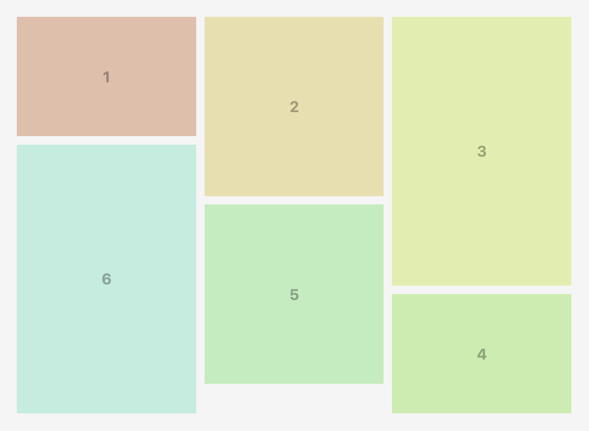

Masonry Grid offers two primary layout algorithms: Balanced and Regular. Understanding the differences between these two approaches can help you choose the right one for your project.

The Regular Masonry Grid arranges items in columns based on their order in the DOM. Items are placed in the next available space in the column, which can lead to uneven column heights:

In contrast, the Balanced Masonry Grid algorithm aims to distribute items in rows to minimize the overall height of the grid:

Reordering is done with `order` CSS property, so the visual order is changed but the DOM order remains the same.
