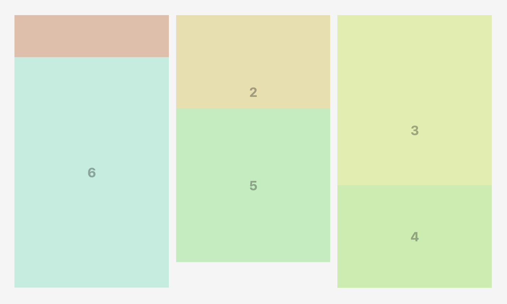

Main issue that can occur when using Masonry Grid is items in colums are overlapping each other or not being positioned correctly:



It usually happens when item can't maintain its aspect ratio correctly, which is required by Masonry Grid to calculate proper positions.

It can be caused by:

- `overflow: hidden` on item, so you should escape using it in item styles
- content of item tries to stratch item size

Most universal solution of this problem is to use additional container in item with absolute positioning to hold the content, for example:

```html
<style>
.frame {
  position: relative; /* make frame position relative */
  aspect-ratio: var(--width) / var(--height);
}

.frame > div {
  position: absolute; /* position content absolutely */
  top: 0;
  right: 0;
  bottom: 0;
  left: 0;
}
</style>
<div class="masonry">
  <div class="frame" style="--width: 4; --height: 3;">
    <div> <!-- additional container for content -->
      
    </div>
  </div>
  ...
</div>
```

If you met same issue using SpannedMasonryGrid, try to decrease `precision`. Most safe value is `10`.
